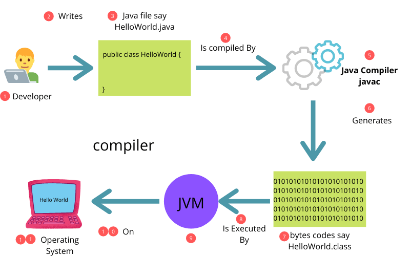
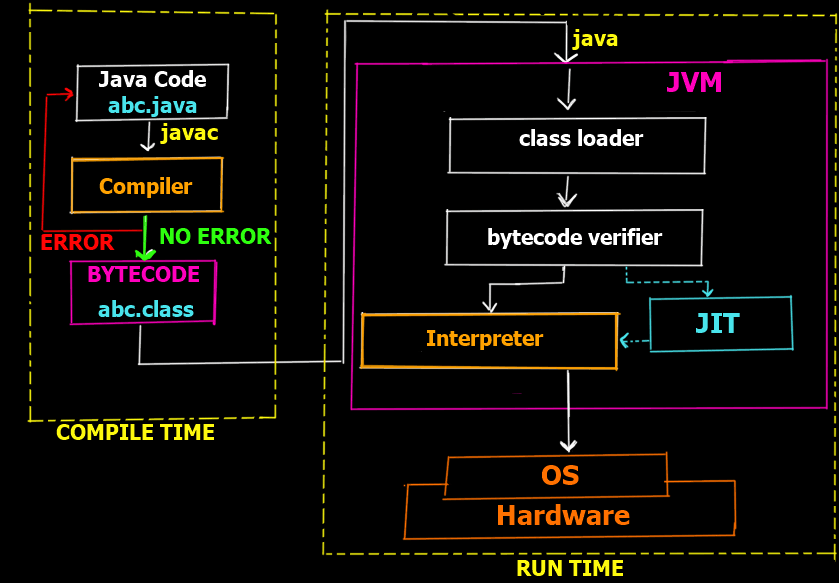
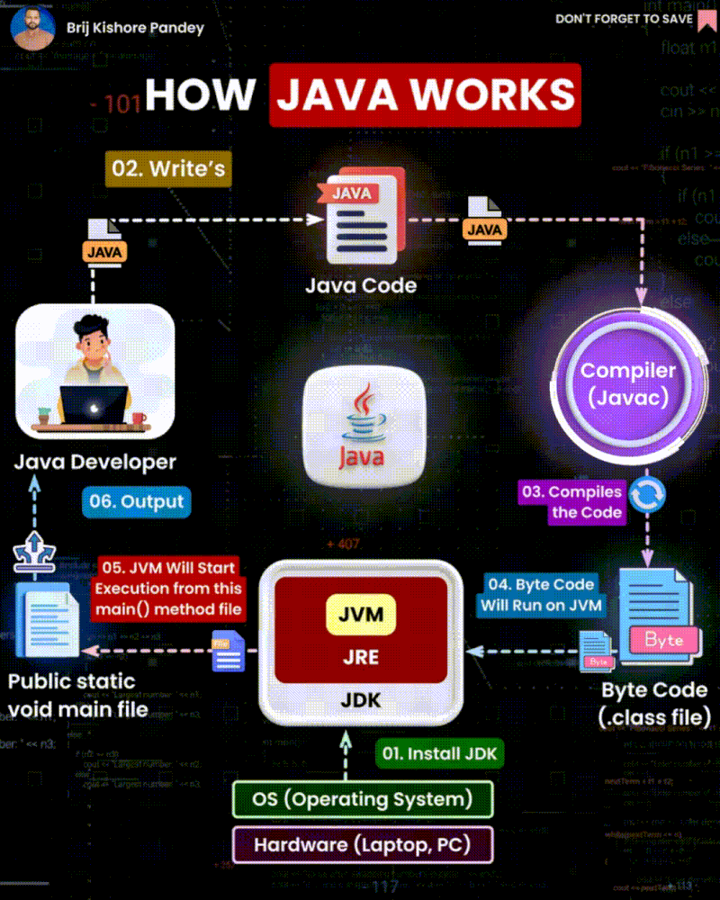

# Module 1 - Introduction to Java

## Topics Covered

- [Principles of Java](#principles)
- [Why Java is so popular?](#popular)
- [How Java works?](#javaWorking)
- [First Program](#firstProgram)

# Java :
Java is a general-purpose, high-level, object-oriented programming language.

<a name="principles"></a>
## Principles of Java :
- Simple, Object-Oriented, and Familiar
- Robust and Secure
- Architecture Neutral and Portable
- Executes with High Performance
- Interpreted, Threaded, and Dynamic

<a name="popular"></a>
## Why Java is so popular?
- Platform Independence
- Fundamentally Object-oriented
- Easy to learn
- Versatile

<a name="javaWorking"></a>
## How Java works?
Java Virtual Machine (JVM) can be present on any device. It must be present to run Java code.









<a name="firstProgram">
<h1>First Program</h1>
</a>

```java


public class Main{

public static void main(String[] args){
    System.out.println(" Ee sala Cup Namde! "); // prints  Ee sala Cup Namde! 
}

}

```
