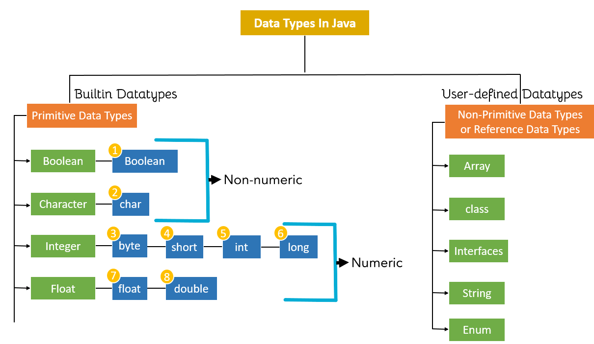
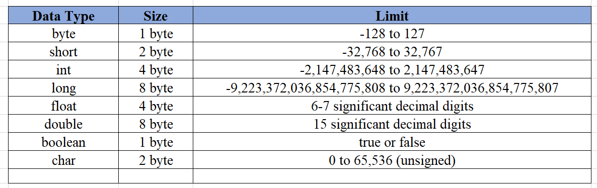
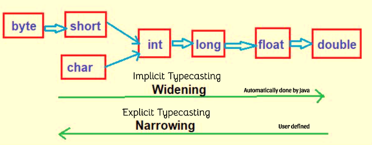

# Module 2 - Variables & Data Types

## Topics Covered

- [Definition](#definition)
- [Rules](#rules)
- [Types of Variables](#types)
- [Datatypes](#datatypes)
- [Typecasting](#typeCasting)
- [Reading Input](#readingInput)


<h1>Variable :</h1><h3>a variable is an abstract storage location paired with an associated symbolic name, which contains some known or unknown quantity of data or object referred to as a value</h3>

<a name="definition"></a>
## Variables in Java : 
### Java variable is a name given to a memory location. It is the basic unit of storage in a program.
- The value stored in a variable can be changed during program execution.
- Variables in Java are only a name given to a memory location. All the operations done on the variable affect that memory location.
- In Java, all variables must be declared before use.

<a name="rules"></a>
## Rules of variable :
1. Variables can consist of Uppercase, Lowercase, Digits and Underscore(_)
2. Variable name cannot start with digit ($, _ , letters allowed)
3. Every variable must be declared
4. It is case sensitive ("myvar" "Myvar" are different)

<a name="types"></a>
## Types of variables :
- Local Variables : `A variable defined within a block or method or constructor is called a local variable.` 
- Instance Variables : `Instance variables are non-static variables and are declared in a class outside of any method, constructor, or block.`
- Static vriables : `Static variables are also known as class variables.`

### 1. Local Variable 
- These variables are created when the block is entered, or the function is called and destroyed after exiting from the block or when the call returns from the function.
- The scope of these variables exists only within the block in which the variables are declared, i.e., we can access these variables only within that block.
- Initialization of the local variable is mandatory before using it in the defined scope.

```java

// Local Variables
import java.io.*;

class GFG {
	public static void main(String[] args)
	{
		// Declared a Local Variable
		int var = 10;

		// This variable is local to this main method only
		System.out.println("Local Variable: " + var);
	}
}

```

### 2. Instance Variables
- As instance variables are declared in a class, these variables are created when an object of the class is created and destroyed when the object is destroyed.
- Unlike local variables, we may use access specifiers for instance variables. If we do not specify any access specifier, then the default access specifier will be used.
- Initialization of an instance variable is not mandatory. Its default value is dependent on the data type of variable. For String it is null, for float it is 0.0f, for int it is 0, for Wrapper classes like Integer it is null, etc.
- Instance variables can be accessed only by creating objects.
- We initialize instance variables using constructors while creating an object. We can also use instance blocks to initialize the instance variables.

```java
// Instance Variables
import java.io.*;

class GFG {

	// Declared Instance Variable
	public String geek;
	public int i;
	public Integer I;
	public GFG()
	{
		// Default Constructor
		// initializing Instance Variable
		this.geek = "Virat kohli";
	}

	// Main Method
	public static void main(String[] args)
	{
		// Object Creation
		GFG name = new GFG();

		// Displaying O/P
		System.out.println("Geek name is: " + name.geek);
		System.out.println("Default value for int is "
						+ name.i);
	
		// toString() called internally
		System.out.println("Default value for Integer is "
						+ name.I);
	}
}

```

### 3. Static Variable
- These variables are declared similarly to instance variables. The difference is that static variables are declared using the static keyword within a class outside of any method, constructor, or block.
- Unlike instance variables, we can only have one copy of a static variable per class, irrespective of how many objects we create.
Static variables are created at the start of program execution and destroyed automatically when execution ends.
- Initialization of a static variable is not mandatory. Its default value is dependent on the data type of variable. For String it is null, for float it is 0.0f, for int it is 0, for Wrapper classes like Integer it is null, etc.
- If we access a static variable like an instance variable (through an object), the compiler will show a warning message, which won’t halt the program. The compiler will replace the object name with the class name automatically.
- If we access a static variable without the class name, the compiler will automatically append the class name. But for accessing the static variable of a different class, we must mention the class name as 2 different classes might have a static variable with the same name.
- Static variables cannot be declared locally inside an instance method.
- Static blocks can be used to initialize static variables.

```java
// Static variables
import java.io.*;

class GFG {
	// Declared static variable
	public static String geek = "Shubham Jain";

	public static void main(String[] args)
	{

		// geek variable can be accessed without object
		// creation Displaying O/P GFG.geek --> using the
		// static variable
		System.out.println("Geek Name is : " + GFG.geek);

		// static int c=0;
		// above line,when uncommented,
		// will throw an error as static variables cannot be
		// declared locally.
	}
}

```
## Differences Between the Instance Variables and the Static Variables

| Instance Variable                  | Static Variable                    |
|------------------------------------|------------------------------------|
| • Each object will have its        | • we can only have one copy        |
|   own copy of an instance variable |   of a static variable per class   |
|									 |									  |
| • Changes made in an instance      | • Changes will be reflected in     |
|   variable using one object will   |   other objects as static variables|
|   not be reflected in other objects|   are common to all objects of a   |
|   as each object has its own copy  |   class                            |
|   of the instance variable         |                                    |
|									 |									  |
| • We can access instance variables | • Static variables can be accessed |
|   through object references        |   directly using the class name    |
|									 |									  |
| • Instance variables are created   | • Static variables are created when|
|   when an object is created with   |   the program starts and destroyed |
|   the use of the keyword 'new' and |   when the program stops           |
|   destroyed when the object is     |                                    |
|   destroyed                        |                                    |  


## Final Keyword

`Final keyword is used for constants and read-only`

```java
//Here pi cannot be redefined
final double pi = 3.1475926;

```

### Declare many variables:

| Wrong Method                       | Correct Method                     |
|------------------------------------|------------------------------------|
| int x = 5;						 |	int x = 5; y = 9; z=10;			  |
| int y = 9;						 |									  |
| int z = 10;						 |				OR					  |
|									 |	int x,y,z;						  |
|									 |  x=y=z=50;						  |
|									 |									  |


## Identifiers : 
### All variables must be declared/identified with unique names.


<a name="datatypes"></a>

## Datatypes
- Type of Data stored in Memeory location
- Max and min value of range location
- Different types of operations on memory location
- Size of memory location







```java

// ---- Primitive Datatypes

byte b = 100;
short s = 123;
int v = 123543;
int calc = -9876345;
long amountVal = 1234567891;
float intrestRate = 12.25f;
double sineval = 12345.234d;
boolean flag = true;
boolean val = false;
char ch1 = 88; // code for X
char ch2 = 'Y';

```

<a name="typeCasting"></a>

## Typecasting
`refers to changing the type of Data from one form to another`




```java

/***** Widening Typecasting *****/

int i = 20;
long rcb  = i;


/***** Narrowing Typecasting *****/

long ban = 1000000;  // !!!!---You cannot do this
int ipl = ban;       

long csk_Ban = 1000000;  // Explicitly Specified
int ipl = int(csk_Ban);  // Now this is Correct :)     

```
`If not in range, Java will not give error, instead lossy conversion.(Number is lost)`

<a name="readingInput"></a>

## Reading Input : import java.util.Scanner;

| Method        | Description                            |
|---------------|----------------------------------------|
| nextBoolean() | Reads a boolean value from the user     |
| nextByte()    | Reads a byte value from the user        |
| nextDouble()  | Reads a double value from the user      |
| nextFloat()   | Reads a float value from the user       |
| nextInt()     | Reads an int value from the user        |
| nextLine()    | Reads a String value from the user      |
| nextLong()    | Reads a long value from the user        |
| nextShort()   | Reads a short value from the user       |


```java

import java.util.Scanner;

public class UserInputExample {
    public static void main(String[] args) {
        Scanner scanner = new Scanner(System.in);

        // Reading boolean input
        System.out.print("Enter a boolean (true/false): "); // e.g., true
        boolean boolInput = scanner.nextBoolean();
        System.out.println("Boolean entered: " + boolInput);

        // Reading byte input
        System.out.print("Enter a byte value: "); // e.g., 127
        byte byteInput = scanner.nextByte();
        System.out.println("Byte entered: " + byteInput);

        // Reading double input
        System.out.print("Enter a double value: "); // e.g., 123.45
        double doubleInput = scanner.nextDouble();
        System.out.println("Double entered: " + doubleInput);

        // Reading float input
        System.out.print("Enter a float value: "); // e.g., 12.34
        float floatInput = scanner.nextFloat();
        System.out.println("Float entered: " + floatInput);

        // Reading int input
        System.out.print("Enter an integer value: "); // e.g., 123
        int intInput = scanner.nextInt();
        System.out.println("Integer entered: " + intInput);

        // Consume the newline character left by nextInt()
        scanner.nextLine();

        // Reading String input
        System.out.print("Enter a string: "); // e.g., Hello World
        String stringInput = scanner.nextLine();
        System.out.println("String entered: " + stringInput);

        // Reading long input
        System.out.print("Enter a long value: "); // e.g., 123456789
        long longInput = scanner.nextLong();
        System.out.println("Long entered: " + longInput);

        // Reading short input
        System.out.print("Enter a short value: "); // e.g., 12345
        short shortInput = scanner.nextShort();
        System.out.println("Short entered: " + shortInput);

        // Consume the newline character left by nextShort()
        scanner.nextLine();

        // Reading char input
        System.out.print("Enter a single character: "); // e.g., A
        char charInput = scanner.nextLine().charAt(0);
        System.out.println("Character entered: " + charInput);

        scanner.close();
    }
}

```

| Method       | Description                                                                                           | Example Program                                                                                                                                                                         |
|--------------|-------------------------------------------------------------------------------------------------------|-----------------------------------------------------------------------------------------------------------------------------------------------------------------------------------------|
| `next()`     | Reads the next token from the input. A token is usually a word separated by whitespace.                | ```java                                                                                                                                                                                  |
|              | It does not consume the newline character after the token.                                             | import java.util.Scanner;                                                                                                                                                               |
|              |                                                                                                        |                                                                                                                                                                                         |
|              | ```java                                                                                                                                      | public class ScannerNextExample {                                                                                                                                                       |
|              | Scanner scanner = new Scanner(System.in);                                                                 |     public static void main(String[] args) {                                                                                                                                              |
|              | System.out.print("Enter a string: ");  // e.g., Hello World                                           |         Scanner scanner = new Scanner(System.in);                                                                                                                                       |
|              | String token = scanner.next();  // Reads "Hello" and leaves "World" and newline in the input buffer   |                                                                                                                                                                                         |
|              | System.out.println("Token: " + token);  // Output: Token: Hello                                       |         System.out.print("Enter a string using next(): ");  // e.g., Hello World                                                                  |
|              |                                                                                                        |         String token = scanner.next();  // Reads "Hello" and leaves "World" and newline in the input buffer                                       |
|              | ```                                                                                                                                           |         System.out.println("Token using next(): " + token);  // Output: Token: Hello                                                              |
|              |                                                                                                        |                                                                                                                                                                                         |
|              |                                                                                                        |         // Consume the remaining input                                                                                                                                                   |
|              |                                                                                                        |         scanner.nextLine();                                                                                                                                                             |
|              |                                                                                                        |                                                                                                                                                                                         |
|              |                                                                                                        |         System.out.print("Enter a string using nextLine(): ");  // e.g., Hello World                                                               |
| `nextLine()` | Reads the entire line of input, including spaces, until the newline character is encountered.         |         String line = scanner.nextLine();  // Reads the entire line including spaces                                                              |
|              | It consumes and discards the newline character.                                                       |         System.out.println("Line using nextLine(): " + line);  // Output: Line: Hello World                                                       |
|              |                                                                                                        |                                                                                                                                                                                         |
|              | ```java                                                                                                                                      |         scanner.close();                                                                                                                                                                |
|              | Scanner scanner = new Scanner(System.in);                                                                 |     }                                                                                                                                                                                   |
|              | System.out.print("Enter a string: ");  // e.g., Hello World                                           | }                                                                                                                                                                                       |
|              | String line = scanner.nextLine();  // Reads "Hello World" including spaces and newline character      | ```                                                                                                                                                                                     |
|              | System.out.println("Line: " + line);  // Output: Line: Hello World                                     |                                                                                                                                                                                         |
|              |                                                                                                        |                                                                                                                                                                                         |
|              | ```                                                                                                                                           |                                                                                                                                                                                         |


